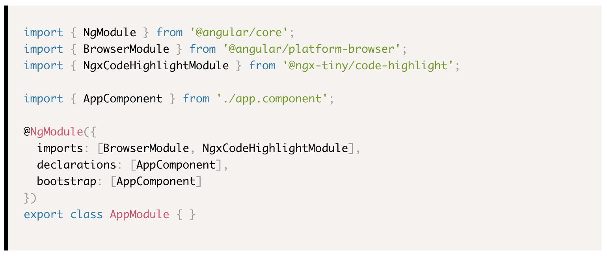

# @ngx-tiny/code-highlight

Angular Code Formatter.

* Angular 8 implementation
* Works with SSR
* Depends on `prismjs`

## Installation

```sh
$ npm i @ngx-tiny/code-highlight
```


## Example



## Documentation

__Full Docs:__

You can find the full documentation at https://aavanzyl.github.io/ngx-tiny which includes
* Installation instructions
* Usage and Demos
* API Reference

__Quick Start:__

1. Install with [npm](https://www.npmjs.com): `npm install @ngx-tiny/code-highlight --save`

2. Add __NgxCodeHighlightModule__ to your __@NgModule__ like example below
    ```typescript

    import { NgModule } from '@angular/core';
    import { BrowserModule } from '@angular/platform-browser';
    import { NgxCodeHighlightModule } from '@ngx-tiny/code-highlight';

    import { AppComponent } from './app.component';

    @NgModule({
        imports: [BrowserModule, NgxCodeHighlightModule],
        declarations: [AppComponent],
        bootstrap: [AppComponent]
    })

    export class AppModule { }

    ```
 4. Add the component to your view for basic
    ```html
    <ngx-multi-select 
        placeholder="Select a Country" 
        [options]="options" 
        (valueChange)="onChange($event)">
    </ngx-multi-select>
    ```
    or for Angular forms
    ```html 
    <form [formGroup]="myForm" (ngSubmit)="onSubmit()">
        <ngx-multi-select 
            formControlName="country" 
            [options]="options" 
            placeholder="Select a Country" >
        </ngx-multi-select>
        <button class="btn" type="submit">Submit</button>
    </form>
    ```
    The examples above are quite basic. The picker has much more features and configurations. 
    


## Support

Support me by [becoming a patron](https://www.patreon.com/bePatron?u=27640996) and buying me a beer :) 

## License
See the [LICENSE][license] file.


[license]: /LICENSE
[contributing]: /CONTRIBUTING.md
[docs]: /DOCUMENTATION.md 